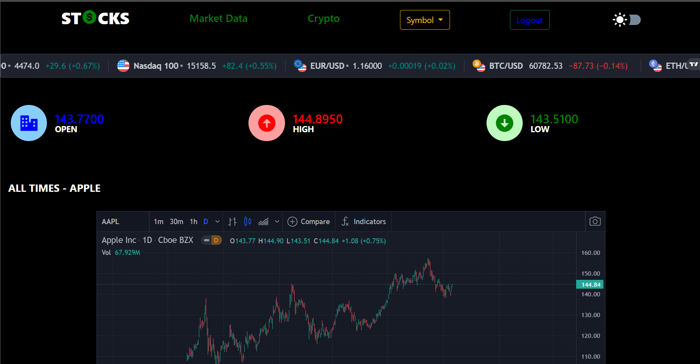

<br />
<p align="center">
  <a href="https://github.com/othneildrew/Best-README-Template">
    
  </a>

  <h3 align="center">STOCKS</h3>

  <p align="center">
    A place to learn about stocks
    <br />
    <br />
</p>

<!-- TABLE OF CONTENTS -->
<details open="open">
  <summary>Table of Contents</summary>
  <ol>
    <li>
      <a href="#about-the-project">About The Project</a>
      <ul>
        <li><a href="#built-with">Built With</a></li>
      </ul>
    </li>
    <li>
      <a href="#getting-started">Getting Started</a>
      <ul>
        <li><a href="#prerequisites">Prerequisites</a></li>
        <li><a href="#installation">Installation</a></li>
      </ul>
    </li>
    <li><a href="#contact">Contact</a></li>
    <li><a href="#acknowledgements">Acknowledgements</a></li>
  </ol>
</details>

<!-- ABOUT THE PROJECT -->

## About The Project



Stocks is a place where one not only learns about the working of a stock market but also gets to do the same with realtime stock market data. There's everything a beginner needs to know all packed in one site. While stock market in itself is endless in terms of learning, <b>STOCKS</b> provides a great start for the journey. Using API's and embeded graphs, it provides a detailed anylasis of every company out there with real time data, charts and symbol overviews.

Here's how it works:

- You're first supposed to sign up, providing your username (unique) and password, if the username is already taken, the user is asked to try again with a different username <br>
  The <b>passwords are hashed</b> which adds a layer of security. Hashing allows passwords to be stored in a format that can't be reversed at any reasonable amount of time or cost for a hacker. It then turns the plaintext password into an output of characters of a fixed length
- You then are supposed to log in, failing to provide a correct Username or password would result in an alert warning user of the invalid credentials and be asked to try again
- Upon successfully logging in, the user will then be directed to the intro page with "Hey, _Your Username_! Welcome to STOCKS. What would you like to do today?", implying that the user logged in successfully!
- After clicking on "Explore" the user will be directed to the main page
- The navbar on top contains the following:
   <ul>
     <li><b>Market Data</b> : Which leads to a page for Market Data which includes a detailed overview of global markets performance, including change value (both in absolute and percentage numbers), Open, High, Low and Close values for the selected financial instruments.</li>
     <li><b>Crypto</b> : Leads to another page that displays most of the available crypto assets and sorts them based on the market capitalization. The key metrics such as the closing price, total and available number of coins, traded volume and price change percentage are all available at a quick glance</li>
     <li><b>Symbol dropdown</b> : For a detailed analysis of every leading company like Apple, Google and Microsoft with their respective symbols, upon clicking a symbol the user is directed to a page with everything one needs to know about that said company including:<br>
     <b>1. Symbol Info</b> : Key symbol info in an easily readable format. Company financials and quotes are available at a quick glance. <br>
     <b>2. Technical Analysis</b> : displays ratings based on technical indicators allowing users to see the summary based on all indicators at a quick glance.The user no longer has to apply multiple indicators to analyze a financial instrument since it does that for the user.<br> On top of that, all ratings are shown in real time.<br>
     <b>3. Company Profile</b> : shows a company description along with key categories - sector & industry. <br>
     <b>4. Symbol Overview</b> : shows latest quotes, a simple chart and key fundamental fields for a single stock. One can add multiple tabs to cover several stocks and use an easy “Chart Only” mode for a simpler look. <br>
     <b>5. Fundamental Data</b> :  displays fundamental data and provides insights into how the company is doing beyond simple stock price information.<br>
     <b>6. Stock Market</b> : shows top 5 gaining, losing and active stocks for the day. Stock Market is updated based on current market activity, so they always show the most relevant stocks</li>
    <li><b>Logout : </b> To log the user out of the site, redirecting back to the login page.</li>
    <li><b>Dark Mode Button</b> : when clicked is used to view the site in dark mode
    </ul>

- Following the navbar there's a <b>Tickertape</b> that is intended to make it simple to add the look and feel of Wall Street to the site.
- Upon scrolling down the user sees 3 pop up cards that show the real time metrics such as <b>Open, High</b> and <b>Close</b> value of AAPL. This was achieved using an API
- The user upon further scrolling sees the <b>Advanced Real-Time Chart</b> which is an AAPL stock chart displaying various useful meterics using a candlestick chart which tracks the movement of securities where each candlestick usually represents one day's worth of price data about a stock. Over time, the candlesticks group into recognizable patterns that investors can use to make buying and selling decisions.
- Right after the chart are 2 <b>YouTube videos</b> embeded with an intent to make sure the user is introduced to the basic idea behind the stock market
- Moving on, there's a <b>24 hour real time data</b> metrics including High, Close, Low, Volume and Open for AAPL displayed using an API
- This is followed by a <b>Symbol Overview</b> which shows latest quotes, a simple chart and key fundamental fields for a single stock
- Which followed by 2 adjacent cards containting: <br> <b>Economic Calender</b> : which shows key upcoming economic events, announcements and news. One can set up relevant economic calendar filters in a few clicks, selecting event importance and affected currencie<br>
  <b>Timeline</b> : Lets you to scan through the complete history and key events of popular companies, cryptocurrencies and other assets.

This is just a beginner-level project, a lot more can be added to this. Looking forward to doing so soon after learning more

A list of commonly used resources that I find helpful is listed in the acknowledgments.

### Built With

I've used the following frameworks and tools in my project:

- [Bootstrap](https://getbootstrap.com)
- [CSS](https://developer.mozilla.org/en-US/docs/Learn/CSS/First_steps/Getting_started)
- [HTML](https://www.htmlpad.net/download.php)
- [Javascript](https://www.javascript.com/)
- [MySQL](https://www.mysql.com/)
- [PHP](https://www.php.net/)
- [API](https://www.freecodecamp.org/news/what-is-an-api-in-english-please-b880a3214a82/)

<!-- GETTING STARTED -->

## Getting Started

To get a local copy up and running follow these simple example steps.

### Prerequisites

List of things you might need:

- XAMPP: for running MySQL and PHP
- CSS, HTML and Javascript extensions

### Installation

1. Make sure you got HTML, CSS and Javascript extenstion
2. Clone the repo
   ```sh
   https://github.com/soumya530G/stockswebsite.git
   ```
3. Install XAMPP on your system
   https://www.apachefriends.org/download.html
4. Get to XAMPP controls and start Apache and MySQL, click on admit for MySQL, it should look like this

   

5. As soon as you click on admin for MySQL, I suggest you create a database _users_, with a table named _users_ and create 4 rows _sno, username, password, dt_ respectively.

   You're good to go!

<!-- CONTACT -->

## Contact

Soumya Gupta <br>
[Twitter](https://twitter.com/@SoumyaG22868897), [Github](https://github.com/soumya530G),
[Linkedin](https://www.linkedin.com/in/soumya-gupta-595a52208/)  
Email: soumyamns002@gmail.com <br>  
Project Link: [https://github.com/soumya530G/stockswebsite.git](https://github.com/soumya530G/stockswebsite.git)
Project Video: [YouTube](https://youtu.be/dBt8v9od2Gk)
<!-- ACKNOWLEDGEMENTS -->

## Acknowledgements

- [Boostrap](https://getbootstrap.com/)
- [Alphavantage](https://www.alphavantage.co/)
- [README template](https://github.com/othneildrew/Best-README-Template/blob/master/README.md#built-with)<br>
- Pictures:
    <ul>
      <li><a href="https://dribbble.com">Dribble</a></li>
      <li><a href="https://in.pinterest.com/">Pinterest</a></li>
    </ul>
- [Font Changer](https://lingojam.com/FontChanger)
- [Trading View](https://in.tradingview.com/)
- YouTube:
    <ul>
      <li><a href="https://www.youtube.com/watch?v=ZCFkWDdmXG8&t=4s">Explained | The Stock Market | FULL EPISODE | Netflix</a></li>
      <li><a href="https://www.youtube.com/watch?v=p7HKvqRI_Bo">How does the stock market work? - Oliver Elfenbaum</a></li>
    </ul>

<!-- MARKDOWN LINKS & IMAGES -->
<!-- https://www.markdownguide.org/basic-syntax/#reference-style-links -->

[contributors-shield]: https://img.shields.io/github/contributors/othneildrew/Best-README-Template.svg?style=for-the-badge
[contributors-url]: https://github.com/othneildrew/Best-README-Template/graphs/contributors
[forks-shield]: https://img.shields.io/github/forks/othneildrew/Best-README-Template.svg?style=for-the-badge
[forks-url]: https://github.com/othneildrew/Best-README-Template/network/members
[stars-shield]: https://img.shields.io/github/stars/othneildrew/Best-README-Template.svg?style=for-the-badge
[stars-url]: https://github.com/othneildrew/Best-README-Template/stargazers
[issues-shield]: https://img.shields.io/github/issues/othneildrew/Best-README-Template.svg?style=for-the-badge
[issues-url]: https://github.com/othneildrew/Best-README-Template/issues
[license-shield]: https://img.shields.io/github/license/othneildrew/Best-README-Template.svg?style=for-the-badge
[license-url]: https://github.com/othneildrew/Best-README-Template/blob/master/LICENSE.txt
[linkedin-shield]: https://img.shields.io/badge/-LinkedIn-black.svg?style=for-the-badge&logo=linkedin&colorB=555
[linkedin-url]: https://linkedin.com/in/othneildrew
[product-screenshot]: images/screenshot.png
